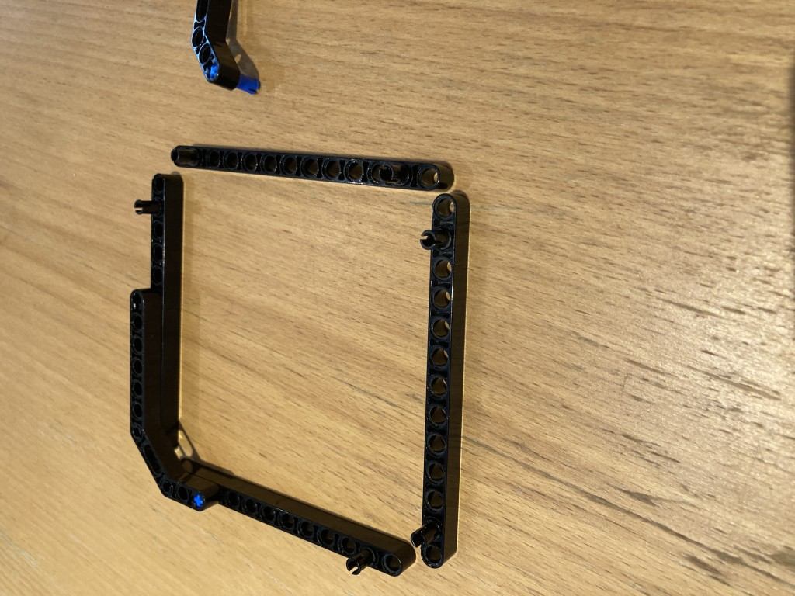
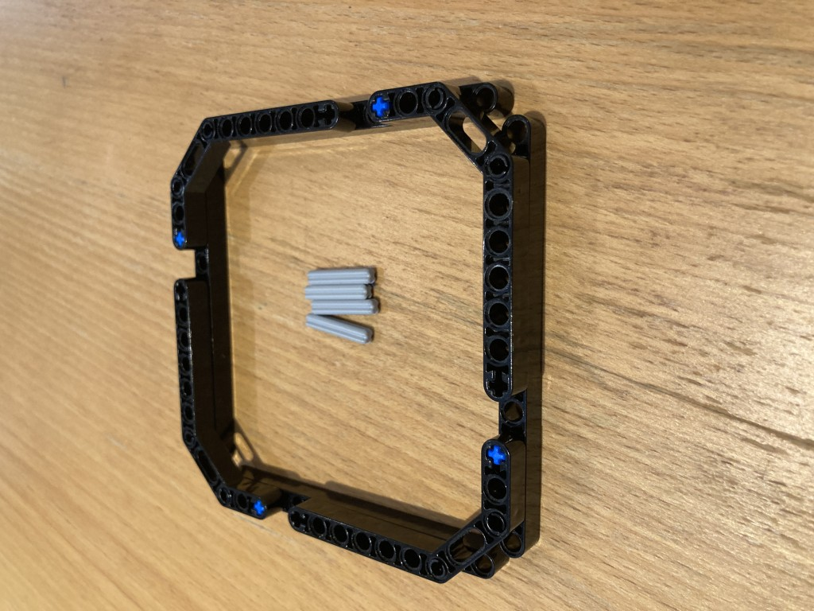
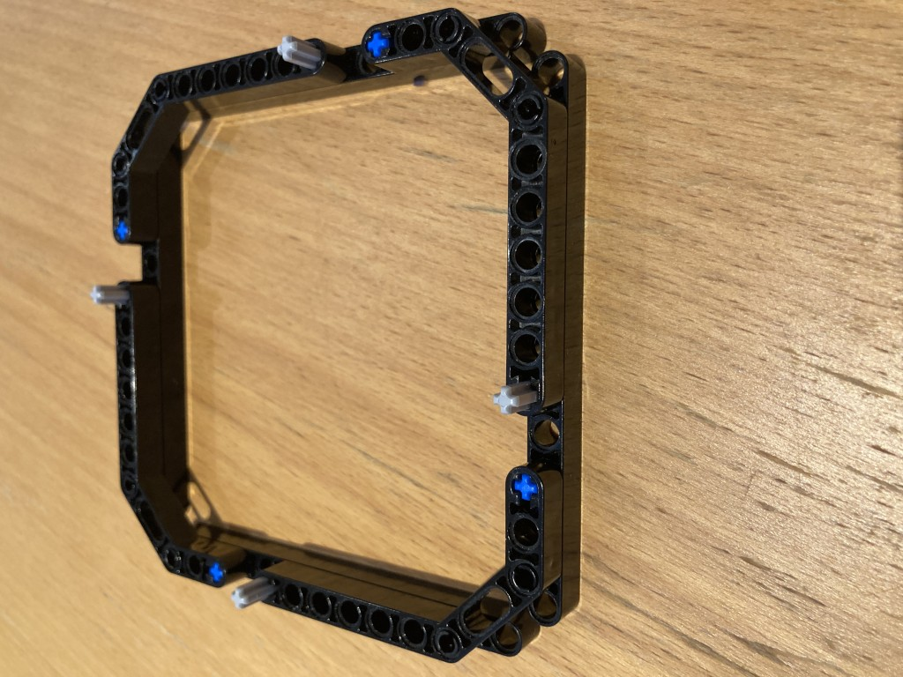
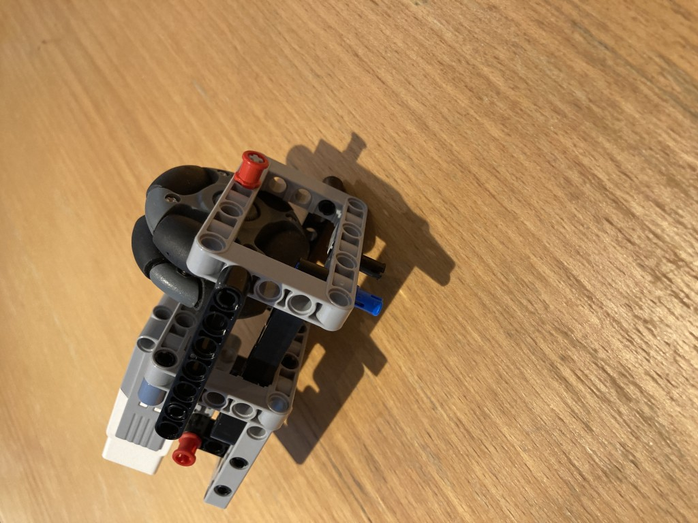

# Base Instructions

The above design is essential the same as for Terry, except the bottom two beams are removed and there is an extra sidebeam.
The below image is same construction as above shown from different angle to illustrate extra beam on side.

In the below image the motor axis should be in the middle of the bottom beam of length 13, ie pin 7 (counting from 1).

