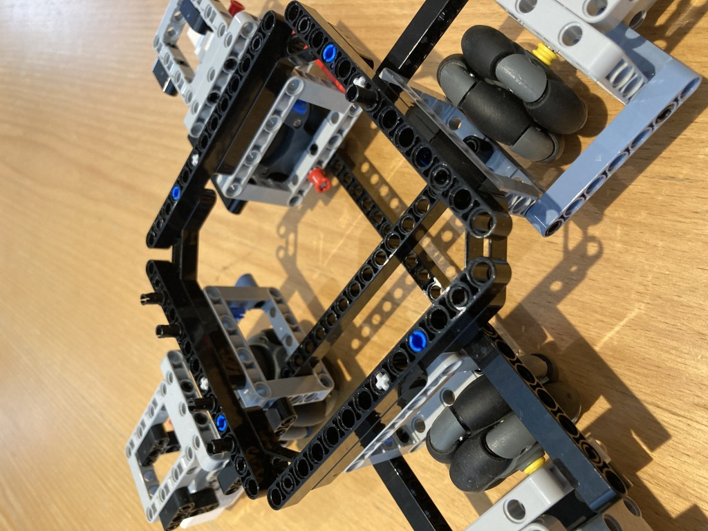

# Final Assembly Instructions

Below image is same construction as above, seen from different angle.

Time to wire up...

The Harry configuration files assume the following wiring: going clockwise, viewed from above starting at front: PORT_D, PORT_A, PORT_B and PORT_C.

It is possible to choose an arbitrary wiring order, but that would require alteration to the configuration files to ensure consistent motor commands.

