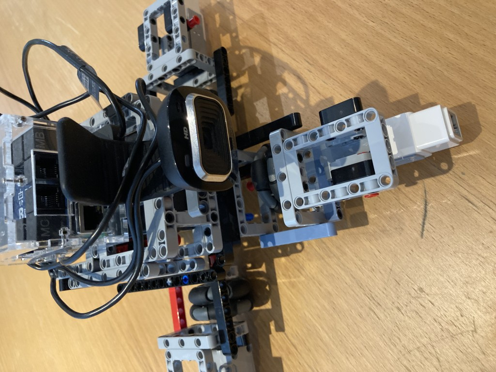

# Final Assembly Instructions

Time to wire up...

The Harry configuration files assume the following wiring: going clockwise, viewed from above starting at front: PORT_A, PORT_B, PORT_C and PORT_D.
By front, I mean the side where you assembled "the front" in the front assembly step. Technically you could start at any side as PORT_A as that would
effectively determine the front (ie forward motion) as long as you proceed in the above order.

It is possible to choose an arbitrary wiring order, but that would require alteration to the configuration files to ensure consistent motor commands.

