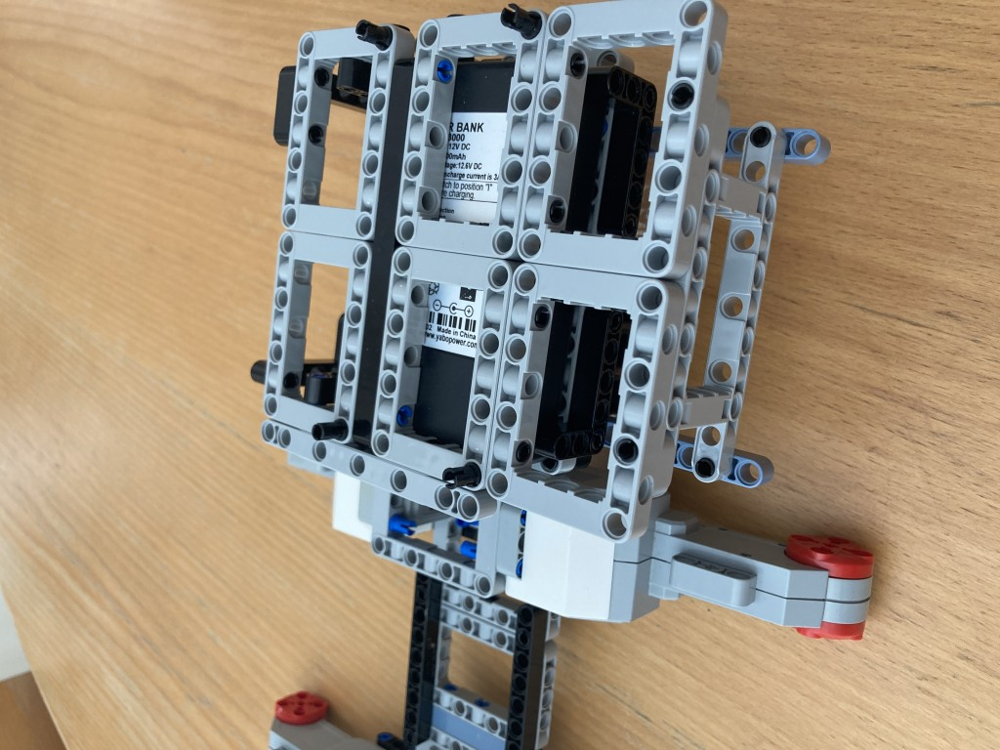
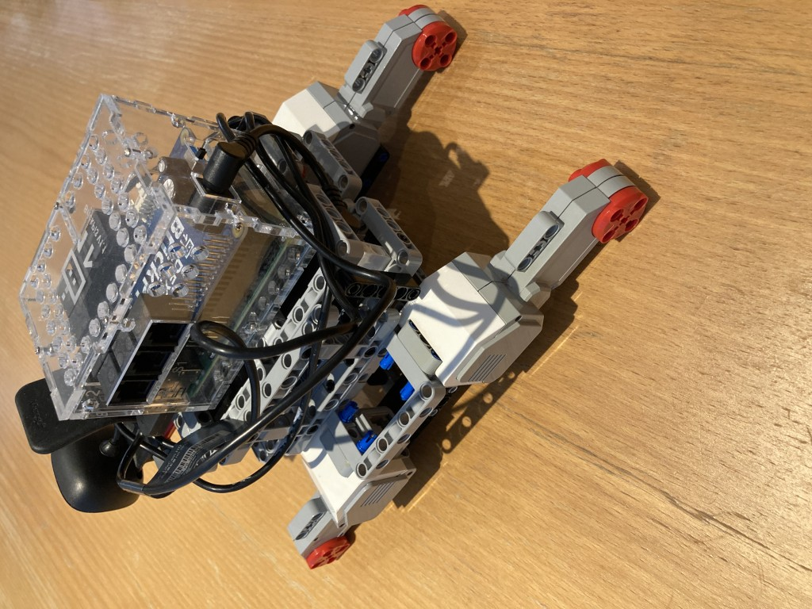
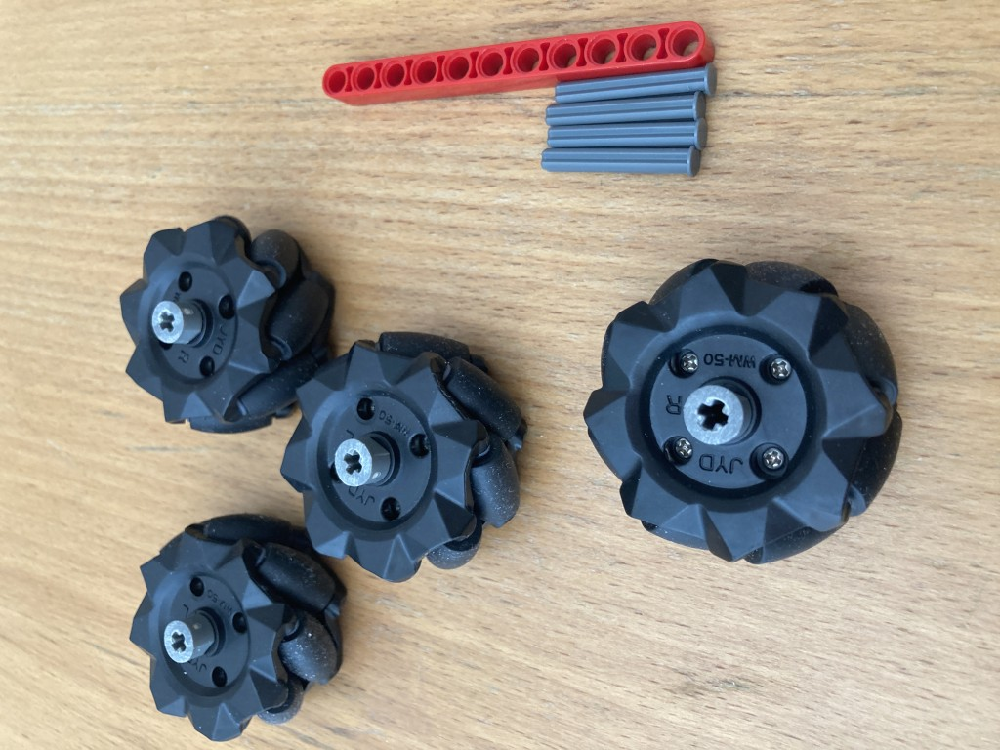
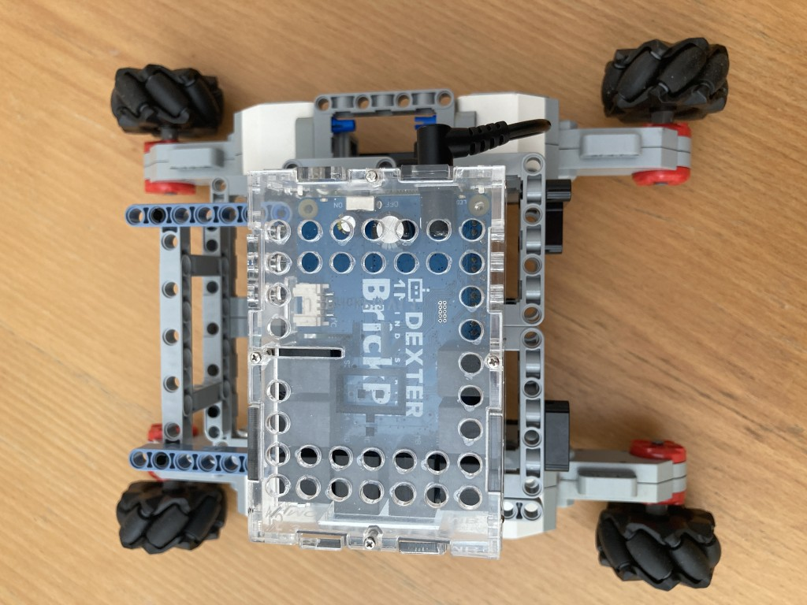
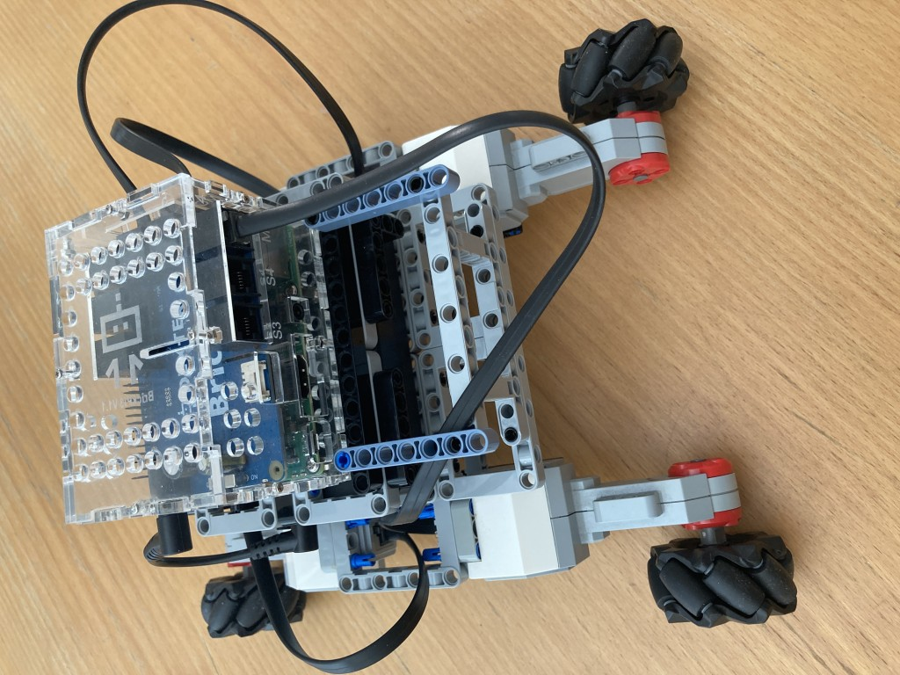

# Final Assembly Instructions

The red beam below is not used, it is there as a visual reference to remind that the axles are of length 4.

Time to wire up... going clockwise starting at front left wheel, the ports are C, D, A, and B respectively.

